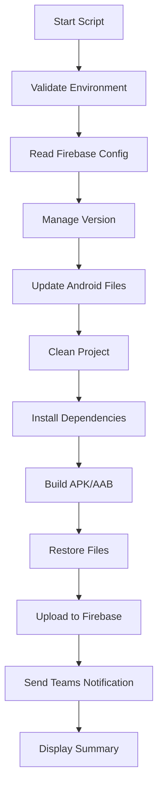
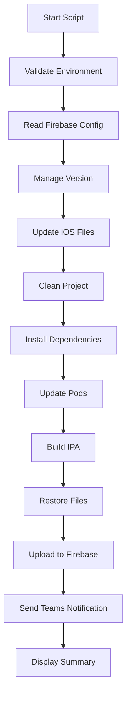

# 🚀 Firebase App Distribution - Build & Deploy Scripts

<div align="center">


**Automated Flutter build and Firebase distribution scripts for Android and iOS**

[Features](#-features) • [Prerequisites](#-prerequisites) • [Installation](#-installation) • [Usage](#-usage) • [Configuration](#%EF%B8%8F-configuration)

</div>

---

## 📋 Table of Contents

- [Overview](#-overview)
- [Features](#-features)
- [Prerequisites](#-prerequisites)
- [Installation](#-installation)
- [Usage](#-usage)
  - [Android Build & Distribution](#-android-build--distribution)
  - [iOS Build & Distribution](#-ios-build--distribution)
- [Configuration](#%EF%B8%8F-configuration)
- [Scripts Breakdown](#-scripts-breakdown)
- [Troubleshooting](#-troubleshooting)
- [Best Practices](#-best-practices)

---

## 🌟 Overview

This repository contains powerful automation scripts designed to streamline your Flutter app deployment workflow. These scripts handle the complete build and distribution pipeline for both Android and iOS applications, automatically uploading builds to Firebase App Distribution and notifying your team via Microsoft Teams.

### What Problem Do These Scripts Solve?

Manual app distribution is time-consuming and error-prone. These scripts automate:
- ✅ Building production-ready APKs, AABs, and IPAs
- ✅ Managing version numbers across platforms
- ✅ Uploading to Firebase App Distribution
- ✅ Notifying testers automatically
- ✅ Sending build notifications to Microsoft Teams

---

## ✨ Features

### 🎯 Core Capabilities

| Feature | Android | iOS | Description |
|---------|---------|-----|-------------|
| 🔨 **Automated Build** | ✅ | ✅ | Builds release-ready artifacts with Flutter |
| 🏷️ **Flavor Support** | ✅ | ✅ | Supports multiple build flavors (dev/prod) |
| 📦 **Multiple Formats** | APK & AAB | IPA | Flexible output formats |
| 📊 **Version Management** | ✅ | ✅ | Auto or manual version control |
| ☁️ **Firebase Upload** | ✅ | ✅ | Automatic distribution to testers |
| 🔔 **Teams Notification** | ✅ | ✅ | Real-time build notifications |
| 🎨 **Beautiful CLI** | ✅ | ✅ | Colored output with progress indicators |
| 🔄 **Auto Restore** | ✅ | ✅ | Restores files on error |

### 🎨 Visual Features

- **Progress Bars**: Real-time build progress visualization
- **Spinners**: Loading animations for long-running tasks
- **Color-Coded Output**: Easy-to-read status messages
- **Emoji Icons**: Quick visual feedback
- **Formatted Summaries**: Detailed build reports

---

## 📦 Prerequisites

Before using these scripts, ensure you have the following installed and configured:

### Required Software

```bash
# 1. Flutter SDK
flutter --version

# 2. Firebase CLI
firebase --version

# 3. For iOS only: Xcode Command Line Tools
xcode-select --version

# 4. For iOS only: CocoaPods
pod --version
```

### Installation Commands

```bash
# Install Firebase CLI
npm install -g firebase-tools

# Login to Firebase
firebase login

# For iOS: Install CocoaPods
sudo gem install cocoapods
```

### Firebase Setup

1. **Create Firebase Project**: Visit [Firebase Console](https://console.firebase.google.com/)
2. **Add Android App**: Download `google-services.json` → Place in `android/app/`
3. **Add iOS App**: Download `GoogleService-Info.plist` → Place in `ios/Runner/`
4. **Enable App Distribution**: Navigate to App Distribution in Firebase Console

### Microsoft Teams Setup (Optional)

1. Create a Power Automate workflow with HTTP trigger
2. Configure it to post messages to Teams channel
3. Copy the webhook URL
4. Add it to the scripts (see [Configuration](#%EF%B8%8F-configuration))

---

## 🚀 Installation

### 1. Clone or Download Scripts

```bash
# Make scripts executable
chmod +x build_and_distribute_android.sh
chmod +x build_and_distribute_ios.sh
```

### 2. Place Scripts in Project Root

```
your-flutter-project/
├── android/
├── ios/
├── lib/
├── pubspec.yaml
├── build_and_distribute_android.sh  ← Place here
└── build_and_distribute_ios.sh      ← Place here
```

### 3. Configure Firebase Files

**Android:**
```bash
android/app/google-services.json
```

**iOS:**
```bash
ios/Runner/GoogleService-Info.plist
```

---

## 📱 Usage

## 🤖 Android Build & Distribution

### Basic Usage

```bash
# Build development APK
./build_and_distribute_android.sh

# Build production APK
./build_and_distribute_android.sh production apk

# Build production AAB (for Play Store)
./build_and_distribute_android.sh production aab

# Build with custom version
./build_and_distribute_android.sh production apk "1.2.0" "Bug fixes and improvements"
```

### Command Syntax

```bash
./build_and_distribute_android.sh [flavor] [build_type] [version] [release_notes]
```

### Parameters

| Parameter | Options | Default | Description |
|-----------|---------|---------|-------------|
| `flavor` | `development`, `production` | `development` | Build flavor/variant |
| `build_type` | `apk`, `aab` | `apk` | Output format |
| `version` | `x.y.z` or `auto` | `auto` | Version number |
| `release_notes` | Text string | Auto-generated | Release description |

### Examples

```bash
# Quick development build
./build_and_distribute_android.sh

# Production APK with auto version
./build_and_distribute_android.sh production apk auto "New features added"

# Production AAB with specific version
./build_and_distribute_android.sh production aab "2.1.3" "Critical security patches"
```

---

## 🍎 iOS Build & Distribution

### Basic Usage

```bash
# Build development IPA
./build_and_distribute_ios.sh

# Build production IPA
./build_and_distribute_ios.sh production

# Build with custom version
./build_and_distribute_ios.sh production "1.2.0" "Bug fixes and improvements"
```

### Command Syntax

```bash
./build_and_distribute_ios.sh [flavor] [version] [release_notes]
```

### Parameters

| Parameter | Options | Default | Description |
|-----------|---------|---------|-------------|
| `flavor` | `development`, `production` | `development` | Build flavor/scheme |
| `version` | `x.y.z` or `auto` | `auto` | Version number |
| `release_notes` | Text string | Auto-generated | Release description |

### Examples

```bash
# Quick development build
./build_and_distribute_ios.sh

# Production build with auto version
./build_and_distribute_ios.sh production auto "Performance improvements"

# Production build with specific version
./build_and_distribute_ios.sh production "2.1.3" "UI updates and bug fixes"
```

---

## ⚙️ Configuration

### 1. Firebase Configuration

Both scripts automatically read Firebase App IDs from your configuration files:

**Android (`google-services.json`):**
```json
{
  "client": [
    {
      "client_info": {
        "mobilesdk_app_id": "1:123456789:android:abc123def456"
      }
    }
  ]
}
```

**iOS (`GoogleService-Info.plist`):**
```xml
<key>GOOGLE_APP_ID</key>
<string>1:123456789:ios:abc123def456</string>
```

### 2. Tester Groups

Modify the tester group name in each script (default: `testers`):

```bash
# In both scripts, line ~63
TESTER_GROUP="testers"  # Change to your Firebase tester group name
```

**Creating Tester Groups in Firebase:**
1. Open Firebase Console → App Distribution
2. Click "Testers & Groups" tab
3. Create a new group and add tester emails
4. Use the group name in your script

### 3. Microsoft Teams Webhook (Optional)

To enable Teams notifications:

```bash
# In both scripts, line ~65-66
TEAMS_WEBHOOK_URL="your-power-automate-webhook-url"
```

**To disable Teams notifications:**
```bash
TEAMS_WEBHOOK_URL=""  # Leave empty
```

### 4. Version Management

**Automatic versioning** (reads from `pubspec.yaml`):
```yaml
# pubspec.yaml
version: 1.2.3+45
```

**Custom versioning** (via command line):
```bash
./build_and_distribute_android.sh production apk "2.0.0+100" "Major release"
```

---

## 🔍 Scripts Breakdown

### Android Script Architecture



### iOS Script Architecture



### Key Functions

#### 🎨 Visual Functions
- `print_banner()` - Displays welcome banner
- `print_section()` - Section headers
- `spinner()` - Loading animation
- `progress_bar()` - Progress visualization
- `print_success/error/warning/info()` - Status messages

#### 🔧 Core Functions
- `validate_environment()` - Checks for required tools
- `read_firebase_config()` - Extracts Firebase App IDs
- `read_version_from_pubspec()` - Reads app version
- `update_android_version()` / `update_ios_version()` - Updates version files
- `build_android()` / `build_ipa()` - Executes Flutter build
- `upload_to_firebase()` - Distributes to testers
- `send_teams_notification()` - Sends webhook notification

---

## 🛠️ Troubleshooting

### Common Issues

#### 1. **Firebase CLI Not Found**

```bash
Error: firebase: command not found
```

**Solution:**
```bash
npm install -g firebase-tools
firebase login
```

#### 2. **Flutter Not Found**

```bash
Error: flutter: command not found
```

**Solution:**
```bash
# Add Flutter to PATH
export PATH="$PATH:`pwd`/flutter/bin"

# Or install Flutter from https://flutter.dev/docs/get-started/install
```

#### 3. **Google Services File Not Found**

```bash
Error: google-services.json not found!
```

**Solution:**
- Download from Firebase Console → Project Settings → Your Apps
- Place in correct location:
  - Android: `android/app/google-services.json`
  - iOS: `ios/Runner/GoogleService-Info.plist`

#### 4. **Permission Denied**

```bash
Error: Permission denied
```

**Solution:**
```bash
chmod +x build_and_distribute_android.sh
chmod +x build_and_distribute_ios.sh
```

#### 5. **Xcode Command Line Tools Not Found (iOS)**

```bash
Error: xcode-select: command not found
```

**Solution:**
```bash
xcode-select --install
```

#### 6. **CocoaPods Issues (iOS)**

```bash
Error: pod: command not found
```

**Solution:**
```bash
sudo gem install cocoapods
pod setup
```

#### 7. **Firebase Upload Failed**

```bash
Error: Failed to upload to Firebase
```

**Solutions:**
- Verify you're logged into Firebase: `firebase login`
- Check internet connection
- Verify App ID in Firebase Console matches your config files
- Ensure App Distribution is enabled in Firebase

#### 8. **Teams Notification Failed**

```bash
Warning: Failed to send Teams notification (HTTP 400/500)
```

**Solutions:**
- Verify webhook URL is correct
- Check Power Automate workflow is turned ON
- Test webhook manually with curl
- Leave `TEAMS_WEBHOOK_URL=""` to disable notifications

---

## 💡 Best Practices

### 1. Version Management

```bash
# Always use semantic versioning
✅ 1.2.3+45  # GOOD
❌ 1.2       # BAD - Missing build number
```

### 2. Release Notes

```bash
# Be descriptive and concise
✅ "Fixed login bug, improved performance, added dark mode"
❌ "updates"  # BAD - Not informative
```

### 3. Build Types

**APK:**
- Use for quick testing
- Easy to share
- No signing required

**AAB (Android):**
- Required for Google Play Store
- Smaller download size
- Optimized for devices

### 4. Flavors

```bash
# Development builds
./build_and_distribute_android.sh development

# Production builds
./build_and_distribute_android.sh production
```

### 5. Testing Before Production

```bash
# Always test development build first
./build_and_distribute_android.sh development apk

# Then build production
./build_and_distribute_android.sh production aab "v1.2.3 - Ready for release"
```

### 6. Git Integration

Consider adding these to your `.gitignore`:

```gitignore
# Build outputs
build/
*.apk
*.aab
*.ipa

# Backups created by scripts
*.bak
*.backup
```

### 7. CI/CD Integration

These scripts work great with CI/CD pipelines:

```yaml
# Example GitHub Actions
- name: Build and Distribute Android
  run: |
    chmod +x build_and_distribute_android.sh
    ./build_and_distribute_android.sh production aab "${{ github.ref_name }}" "Release ${{ github.ref_name }}"
```

---

## 📊 Script Output Example

```
╔════════════════════════════════════════════════════════════════╗
║                                                                ║
║        🚀  Firebase App Distribution Build Script  🚀          ║
║                                                                ║
║                     Android APK/AAB Builder                    ║
║                                                                ║
╚════════════════════════════════════════════════════════════════╝

╭─────────────────────────────────────────────────────────────╮
│ 🔥 Firebase Configuration
╰─────────────────────────────────────────────────────────────╯

🚀 Reading Firebase configuration from google-services.json...
✅ Firebase App ID loaded
  └─ App ID: 1:123456789:android:abc123def4...

╭─────────────────────────────────────────────────────────────╮
│ ℹ️ Version Configuration
╰─────────────────────────────────────────────────────────────╯

🚀 Reading version from pubspec.yaml...
✅ Version: 1.2.3 (45)
  └─ Name: 1.2.3
  └─ Code: 45

╭─────────────────────────────────────────────────────────────╮
│ 🔨 Building Android APK
╰─────────────────────────────────────────────────────────────╯

Build Configuration:
  └─ Flavor: production
  └─ Type: APK
  └─ Version: 1.2.3 (45)

🚀 Starting build process...
✅ Build completed successfully
✅ Build artifact ready
  └─ Path: app-production-release.apk
  └─ Size: 45.2M

╭─────────────────────────────────────────────────────────────╮
│ ☁️ Uploading to Firebase
╰─────────────────────────────────────────────────────────────╯

✅ Upload completed successfully!

╭─────────────────────────────────────────────────────────────╮
│ 🔥 Build Summary
╰─────────────────────────────────────────────────────────────╯

╔════════════════════════════════════════════════════════════════╗
║  ✅ Build & Distribution Completed Successfully!               ║
╠════════════════════════════════════════════════════════════════╣
║                                                                ║
║  📦 Artifact Type:  APK                                        ║
║  🔨  Flavor:         production                                ║
║  ℹ️  Version:        1.2.3 (45)                               ║
║  ⏱️  Duration:       3m 24s                                   ║
║                                                                ║
╠════════════════════════════════════════════════════════════════╣
║  ☁️ Testers will receive download notification                ║
║  🔥  View in Firebase Console:                                ║
║  https://console.firebase.google.com/project/_/appdistribution ║
║                                                                ║
╚════════════════════════════════════════════════════════════════╝
```

---

## 📝 Additional Resources

### Official Documentation

- [Flutter Documentation](https://flutter.dev/docs)
- [Firebase App Distribution](https://firebase.google.com/docs/app-distribution)
- [Firebase CLI Reference](https://firebase.google.com/docs/cli)
- [Flutter Build Modes](https://flutter.dev/docs/testing/build-modes)

### Useful Commands

```bash
# Check Flutter doctor
flutter doctor -v

# List available Firebase projects
firebase projects:list

# Check current Firebase login
firebase login:list

# Clean Flutter build
flutter clean

# Update dependencies
flutter pub get
```

---

## 🤝 Contributing

If you find issues or have improvements:

1. Fork the repository
2. Create a feature branch
3. Make your changes
4. Submit a pull request

---

## 📄 License

These scripts are provided as-is for use in your Flutter projects. Feel free to modify and distribute as needed.

---

## ⭐ Support

If you find these scripts helpful, please:
- ⭐ Star the repository
- 🐛 Report issues
- 💡 Suggest improvements
- 📢 Share with others

---

<div align="center">

**Made with ❤️ for the Flutter Community**

🚀 Happy Building! 🚀

</div>
